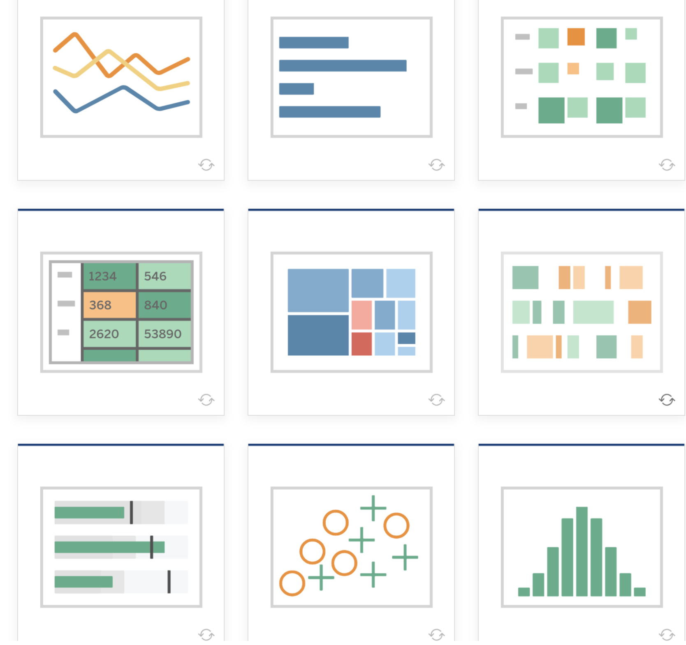
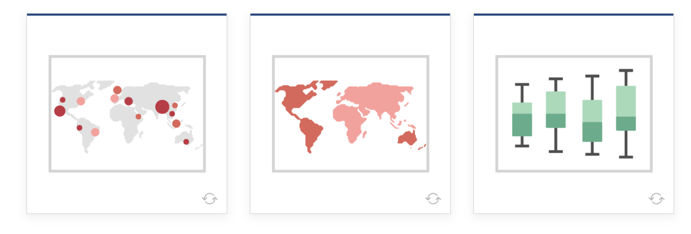

* `Line`            : View trends in data over time.  

    Examples:  Stock price change over a five-year period or website page views during a month.

* `Bar`             : Compare data across categories.

    Examples: Volume of shirts in different sizes, or percent of spending by department.

* `Heat Map`        : Show the relationship between two factors.

    Examples: Segment analysis of target market, or sales leads by individual rep.

* `Highlight Table` : Shows detailed information on heat maps.

    Examples: The percent of a market for different segments, or sales numbers in a  region.

* `Treemap`         : Show hierarchical data as a proportion of a whole.

    Examples: Storage usage across computer machines, comparing fiscal budgets between years.

* `Gantt`           : Show duration over time.

    Examples: Project timeline, duration of a machine’s use, availability of players on a team

* `Bullet`          : Evaluate performance of a metric against a goal. 

    Examples: Sales quota assessment,  performance spectrum (great/good/poor).

* `Scatterplot`     : Investigate relationships between quantitative values.

    Examples: Male versus female likelihood of having lung cancer at different ages, or technology early adopters’ and laggards’ purchase patterns of smart phones.

* `Histogram`       : Understand the distribution of your data.

    Examples: Number of customers by company size, student performance on an exam, frequency of a product defect.

* `Symbol maps`     : Use for totals rather than rates. Be careful, as small differences will be hard to see.

    Examples: Number of customers in different geographies.

* `Area maps`       : Use for rates rather than totals. Use sensible base geography.   
  
    Examples: Rates of internet-usage in certain geographies, house prices in different neighborhoods.  

* `Box-and-Whisker` : Show the distribution of a set of a data. 

    Examples: Understanding your data at a glance, seeing how data is skewed towards one end, identifying outliers in your data.

**Below the figures for different chart types in tableau**

