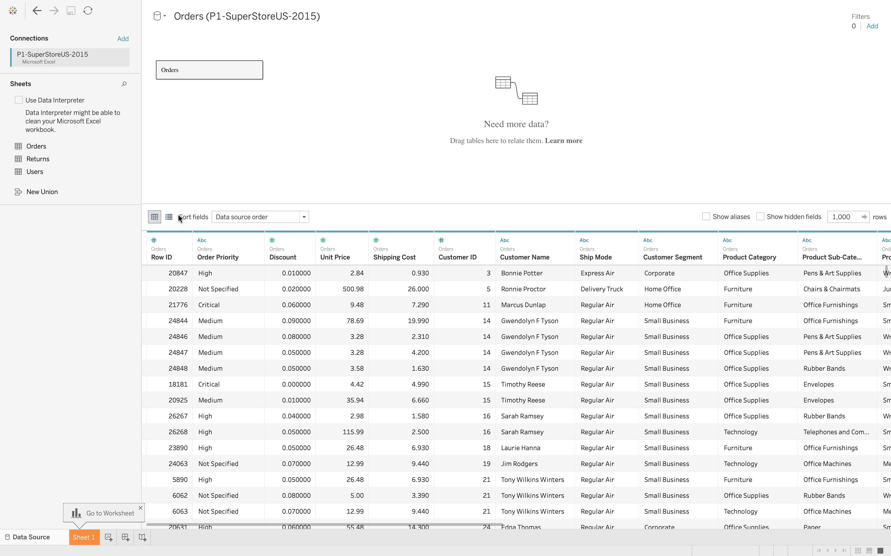
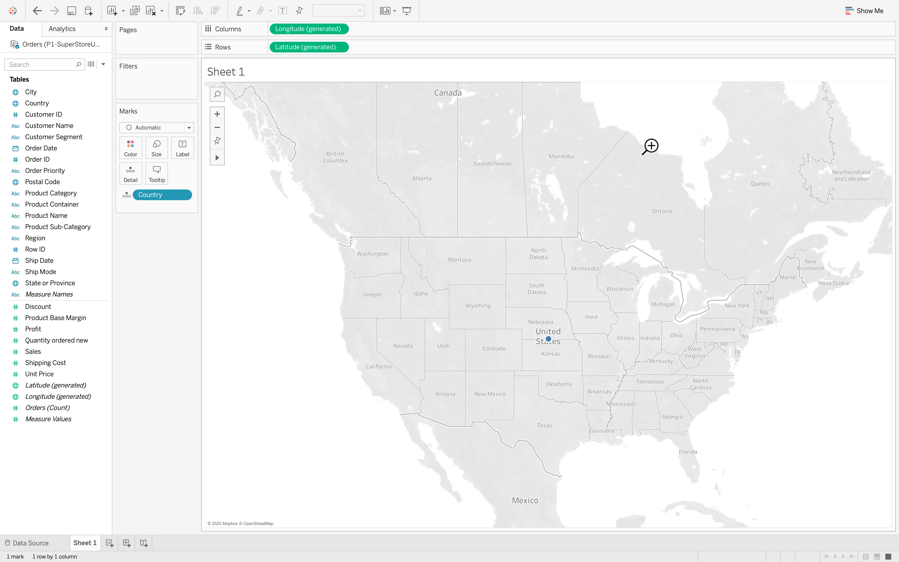
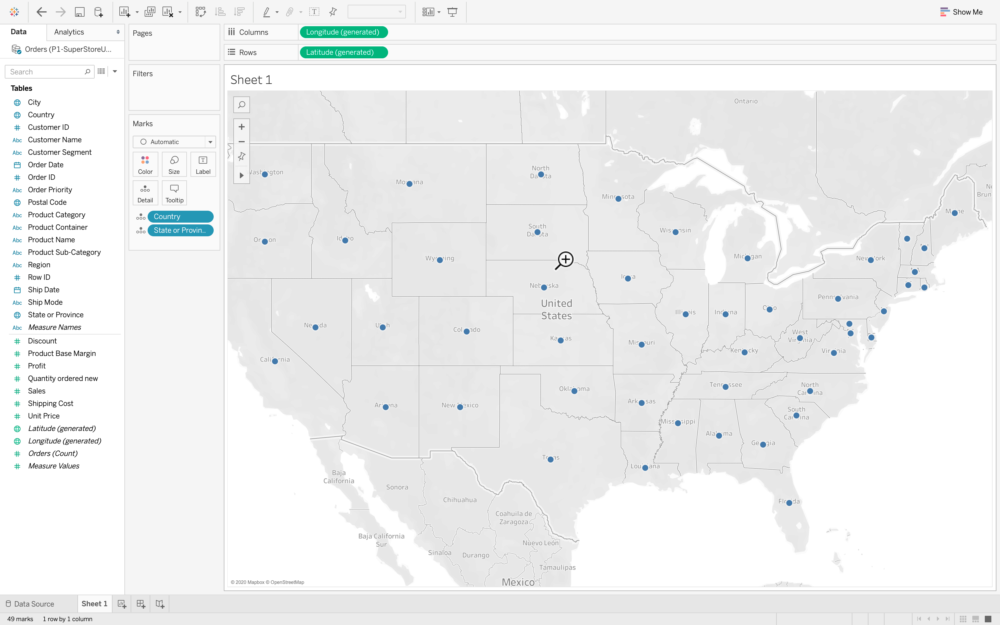
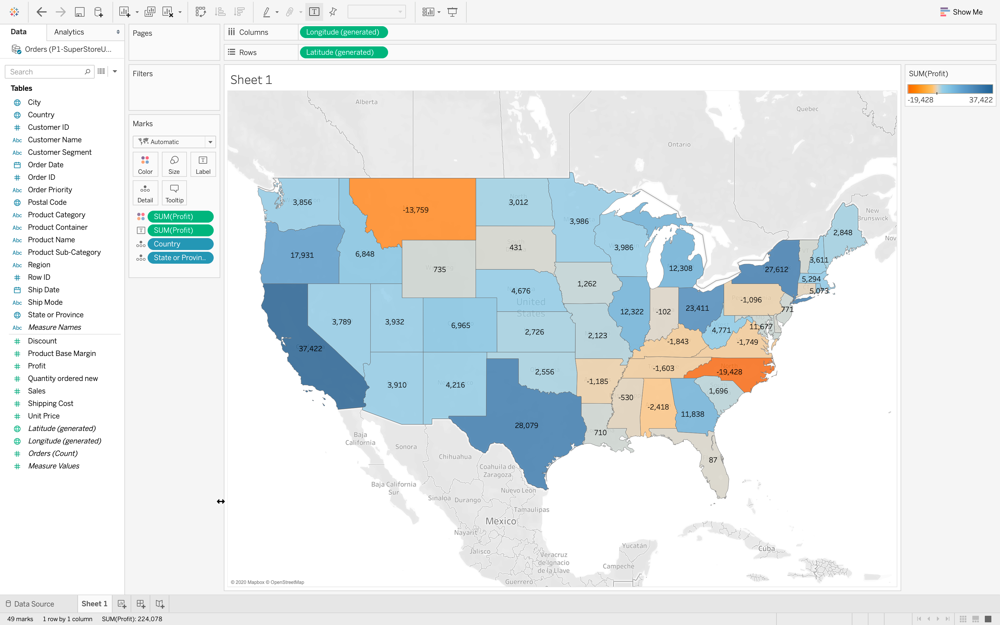
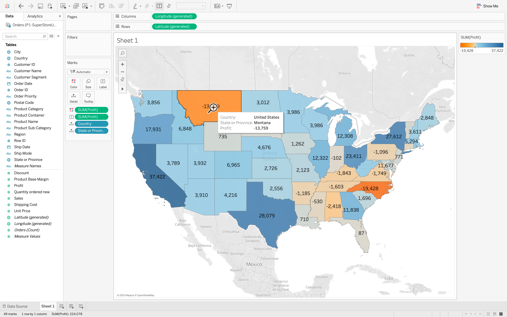

[SuperStore Data](Files/P1-SuperStoreUS-2015.xlsx)

The dataset reprsents the list of transactions for a store in the year 2015. Every transaction is represented by a row.  
The data gives the information like orderId, productname, order date, profit, state, city etc,.

### 1. Create a map to show how the states are performing.

Choose orders tab and drag it into white space.

Click on sheet1

As we are creating map to view how the states are performing, we need to check the profit attained in all states in the country

For this, first we need to drag country to white space, to create country map.

secondly, we drag state of province to note the states as per data

Thirdly, as want a map with respect to profit, drag profit on color (to represent different profits with different colors) and drag profits on labels (to represent the profit value of that particular state).

We can change the font size on clicking on label and changing the font size.  

### 2. What are the most profitable and least profitable states.

By pointing on the specific state, we can get the information about the state name and profit.

Therefore, by just viewing the above map, we can identify the states with high and low profits.

