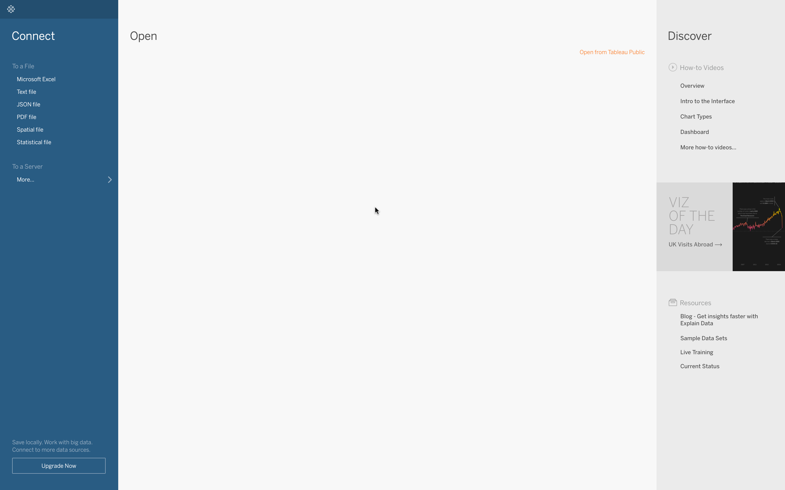
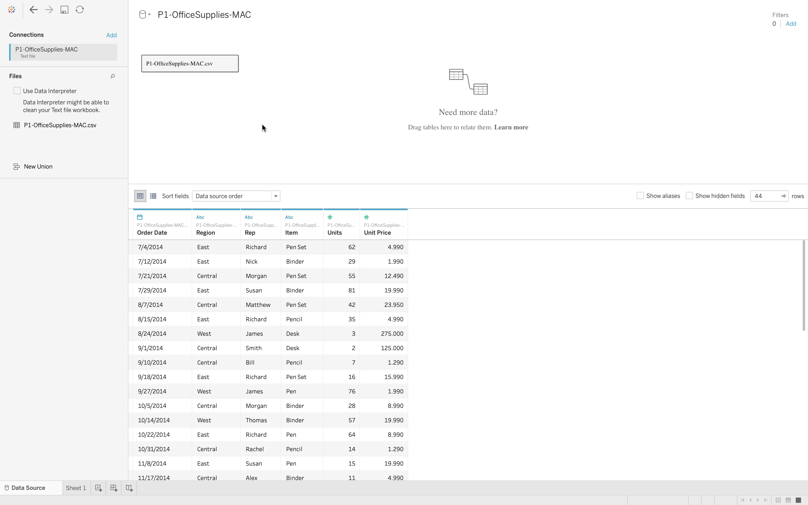
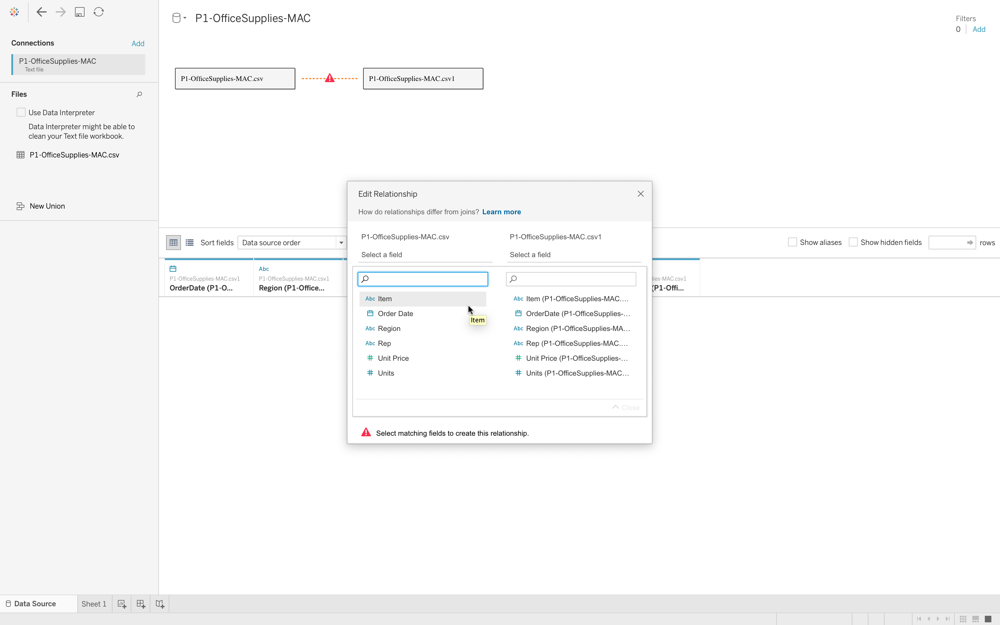
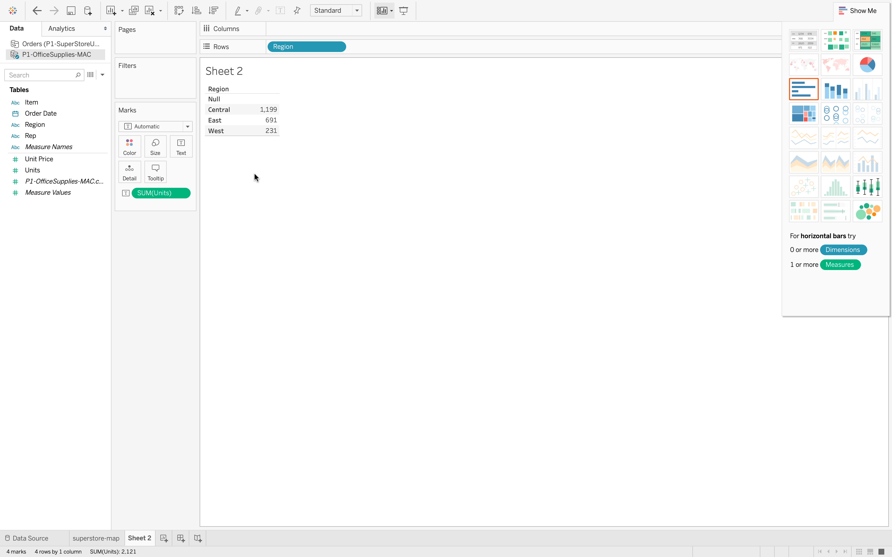
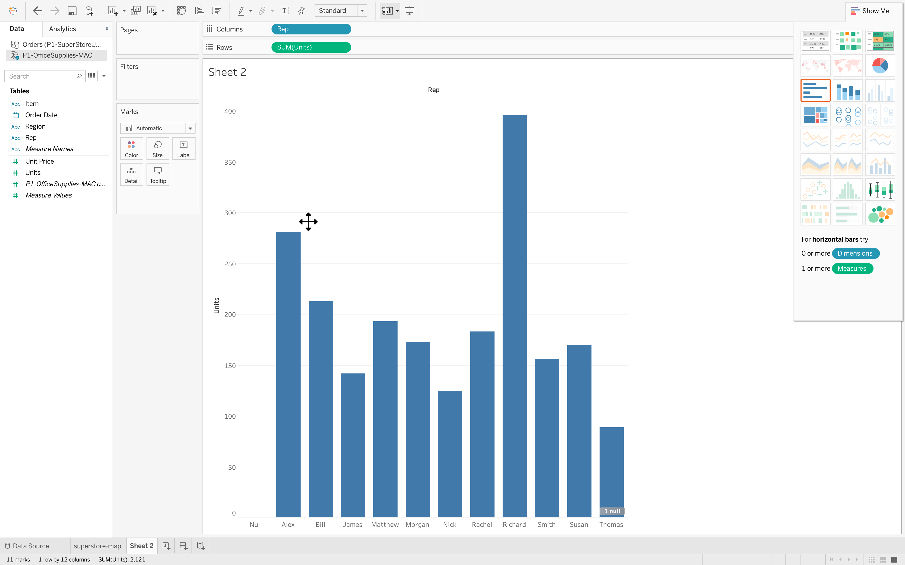
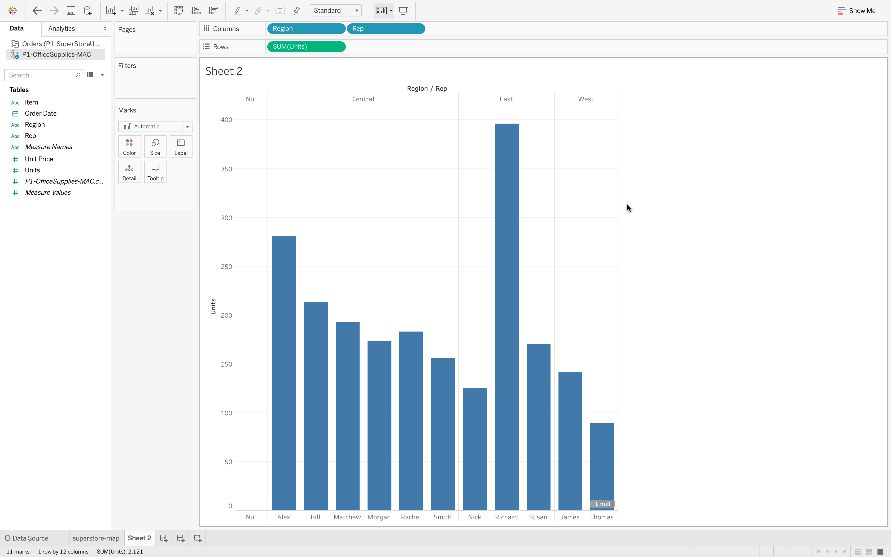
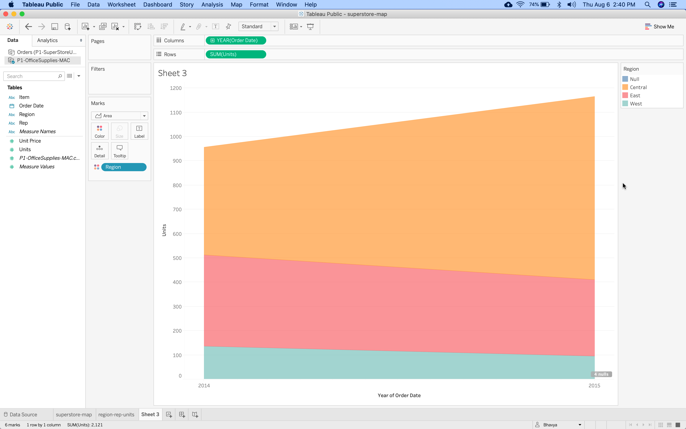
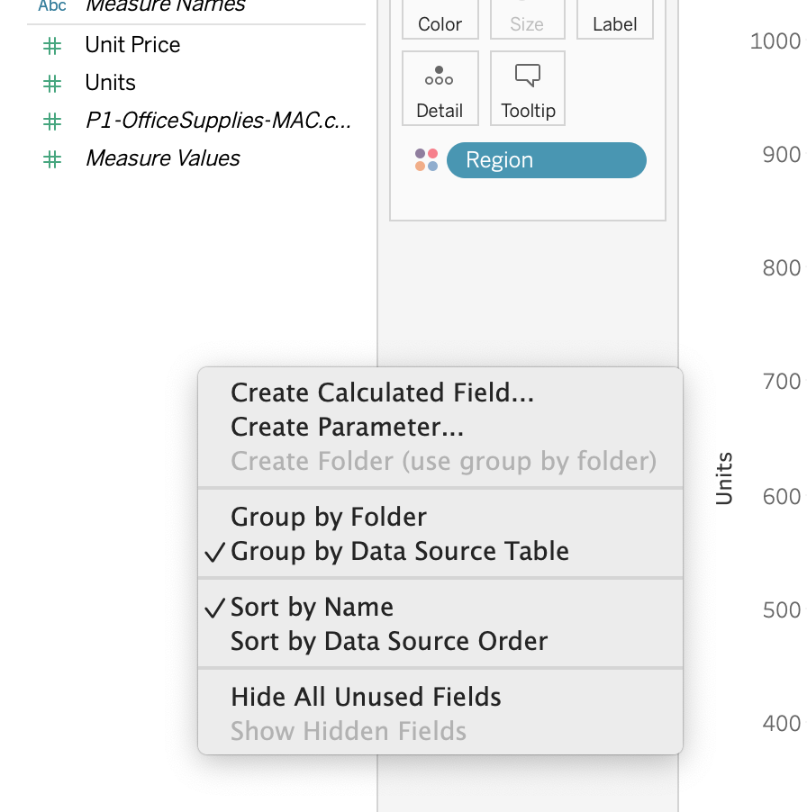
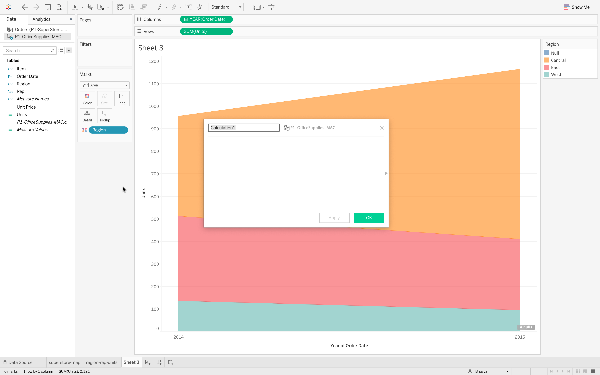
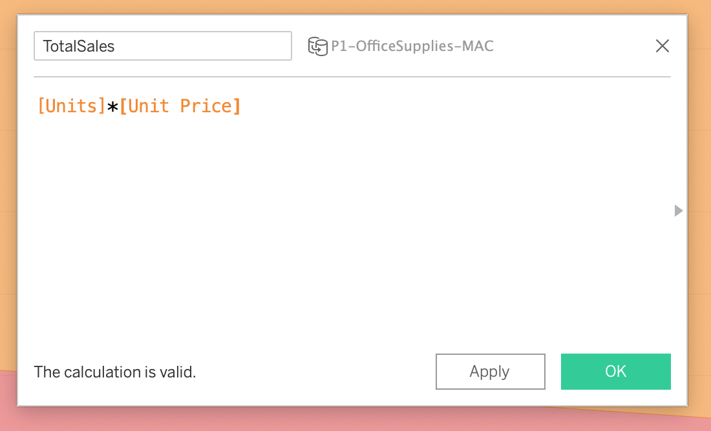

### Challenge
The store operates in three regions and only the top-performing employee in each region qualifies for bonus. Find out which three employees are eligible to get bonuses for this year.  
Employees are measured on total saled($$)

[OfficeSupplies Data](Files/P1-OfficeSupplies-MAC.csv)

#### Connecting Tableau to a Data File

We can connect to different types of file like excel, text, JSON etc,.  
CSV file is basically a text file delimited with commas.  

Click on text file and select the input data.  

We can select as many files as we want and data of selected files will be displayed below window. 
When we want to access more than one file, tableau tries to connect the files as below.

Therefore, the data which we work on tableau may not come from one file, it can come from different files.  

#### Data tab
Data is always broken down into two sections dimensions and measures.  
Dimesions and measures are two different roles any data element can take.  
Any numerical data is kept under measures whereas categorical data is kept under dimensions.  

#### Navigating Tableau

#### Bar chart

#### area chart

#### Creating Calculated fields

To know the total value sold by representative, we need to multiply no.of units with unit price.

For this right click on measures --> Create calculated field --> name the field and values --> click on ok

##### Adding Colors
##### Adding labels and formatting

Format labels in axis and pane

##### Export files from tableau

